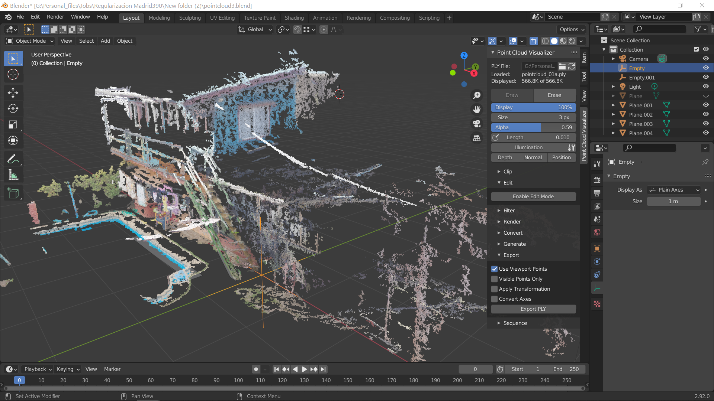

# Point Cloud Visualization


## Table of Contents
- [Introduction](#introduction)
- [Features](#features)
- [Requirements](#requirements)
- [Installation](#installation)
- [Usage](#usage)
- [Contributing](#contributing)
- [License](#license)

## Introduction

This project is a Point Cloud Visualization tool designed to help users visualize and interact with 3D point cloud data. Whether you're working with LiDAR data, 3D scans, or any other form of point clouds, this tool provides a user-friendly interface to explore and analyze the data.

## Features

- **Point Cloud Rendering**: Display 3D point clouds with customizable rendering options.
- **User Interaction**: Navigate through the point cloud using intuitive controls.
- **Color Mapping**: Apply color mapping to visualize additional information associated with each point.
- **Point Selection**: Select and analyze specific points within the cloud.
- **Export**: Save rendered images or export point cloud data to common formats.



## Requirements

- Python 3.x
- Enaml
- vtk

## Installation

1. Clone the repository:

    ```bash
    git clone https://github.com/NGoyal22/Point-Cloud-Visualization.git
    ```

2. Install dependencies:

    ```bash
    cd point-cloud-visualization
    pip install -r requirements.txt
    ```

3. Install vtk

## Usage

1. Run the application:

    ```bash
    python Main.py
    ```

## Contributing

Contributions are welcome! Please follow these steps:

1. Fork the repository.
2. Create a new branch for your feature: `git checkout -b feature-name`.
3. Make your changes and commit them: `git commit -m 'Add new feature'`.
4. Push to the branch: `git push origin feature-name`.
5. Submit a pull request.

Please make sure to update tests as appropriate.